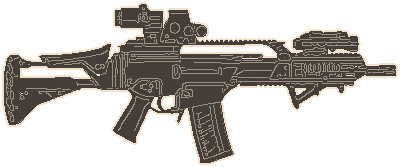
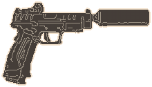

# Image to DK2 UI icon
A FOSS method to automatically generate [Door Kickers 2](https://inthekillhouse.com/doorkickers2/) UI icons from images using [ComfyUI](https://github.com/comfyanonymous/ComfyUI)

 \
 *Example icon of a G36KA4, larger side 400 pixels, default settings, no retouching. Original image by [Ominae](https://www.imfdb.org/wiki/Special:Contributions/Ominae), source: [IMFDB](https://www.imfdb.org/wiki/File:HK_G36KA4_right.jpg)* 

 \
 *XD-D Elite Tactical OSP, larger side 220 pixels, RMBG INSPYRENET, no retouching. Original image by [Springfield Armory](https://www.springfield-armory.com/), source: [thearmorylife.com](https://www.thearmorylife.com/suppressing-the-xd-m-elite-tactical-osp/)* 

## Overview
Load up a source image, enter the desired longer side of the icon to be generated (in pixels), and render the icon.

The workflow will automatically remove the background from the image, crop and resize it, and create an icon in the DK2 color scheme.

After reviewing and tweaking the result, the workflow can save a batch of images to your ComfyUI output folder, currently those are:

| File Name | Notes |
|---|---|
| prefix_00-source.png | the source image as reference |
| prefix_01-body.png | the dark brown background |
| prefix_02-lineart.png | the fine line art inside of the icon |
| prefix_03-outline.png | the 2px thick outline around the icon |
| prefix_04-icon.png | all layers combined into one image |

All images will be properly alpha-masked and resized, and can be opened as layers in GIMP or Photoshop for manual fine-tuning.

Check the [example output](example_output) folder to see what these layers will look like. There's also a bunch of tests in the [DK2 Steam Workshop discussions board](https://steamcommunity.com/workshop/discussions/18446744073709551615/783166598552778265/?appid=1239080)

## What you'll need
- A working installation of [ComfyUI](https://github.com/comfyanonymous/ComfyUI) and [ComfyUIManager](https://github.com/ltdrdata/ComfyUI-Manager)
- Some custom nodes for ComfyUI, see [#Installing custom nodes](#installing-custom-nodes)
- A source image of a weapon or piece of equipment, e.g. from the [Internet Movie Firearms Database](https://imfdb.org)
- A rough idea of how big the icon should be, check the original DK2 UI icons or use the [#reference table](#ui-icon-sizes-reference-table) for some examples
- Basic understanding of ComfyUI and node-based workflows is recommended

## Basic Usage
1. Download the workflow ([.json](image-to-dk2-ui-icon-comfyui.json) or [.png](image-to-dk2-ui-icon-comfyui.png)) and open it in ComfyUI
2. In the `Input` group, enter a name, prefix, and desired larger side (in pixels). 
3. In the `Input` group, use `Load Image` to upload or select a source image
4. Hit `Queue` in Comfy to generate a preview of the icon
5. Review the generated icon in the `Final Comp` group
6. If necessary, adjust output size, tweak parameters and re-run
7. Once you're happy with the result, enable the `Saving` group in `Fast Groups Muter`, then `Queue` to render the images to your output folder

## Keyboard Shortcuts
Using rgthree's Bookmark nodes from [rgthree-comfy](https://github.com/rgthree/rgthree-comfy), you can quickly navigate the workflow using these keyboard shortcuts:

| Shortcut | Function |
|---|---|
| `1` | Input Group |
| `2` | Icon Preview |
| `3` | Canny (Line Detection) |
| `4` | Saving Group |

For a list of built-in ComfyUI keyboard shortcuts check the [ComfyUI Documentation](https://github.com/comfyanonymous/ComfyUI?tab=readme-ov-file#shortcuts)

## Known issues and limitations
This workflow is very much in a proof-of-concept-stage currently, and there's a whole lot to be improved upon. Esp. the line detection part, amount of custom nodes needed etc.

I'm by no means a Comfy expert, and there's many ways to achieve certain things. If you have ideas on how to make this more stream-lined, or are missing a certain feature, feel free to get in touch or re-roll this in your own way.

Also, the result of an automated workflow will never be as good as the work of a skilled artist. But it might give you a starting point, or be a good way to quickly check how a specific weapon might look in-game.

## Troubleshooting
A few common problems and possible solutions:

| Problem | Solution |
|---|---|
| The workflow takes a long time to finish | Check the terminal to see if any models are being downloaded in the background |
| There are no files in my output folder | Make sure the `Saving Group` is enabled |
| Some custom nodes are red/missing when I open the workflow in Comfy | Check if you have all required custom nodes installed, see [#Installing custom nodes](#installing-custom-nodes) |

If you encounter other issues or have questions regarding the workflow, feel free to get in touch.

## Installing custom nodes
When opening the workflow in Comfy with [ComfyUIManager](https://github.com/ltdrdata/ComfyUI-Manager) installed, you should be able to go to

`Manager` -> `Install Missing Custom Nodes`

to automatically download and install all of these. Afterwards restart the server and reload the GUI in your browser.

If that doesn't work, here's a list of the custom nodes used:
- [comfyui_controlnet_aux](https://github.com/Fannovel16/comfyui_controlnet_aux)
- [ComfyUI-Impact-Pack](https://github.com/ltdrdata/ComfyUI-Impact-Pack)
- [ComfyUI-Custom-Scripts](https://github.com/pythongosssss/ComfyUI-Custom-Scripts)
- [ComfyUI_LayerStyle](https://github.com/chflame163/ComfyUI_LayerStyle)
- [rgthree-comfy](https://github.com/rgthree/rgthree-comfy)
- [comfyui-mixlab-nodes](https://github.com/shadowcz007/comfyui-mixlab-nodes)
- [was-node-suite-comfyui](https://github.com/WASasquatch/was-node-suite-comfyui)
- [ComfyUI-RMBG](https://github.com/1038lab/ComfyUI-RMBG)
- [save-image-extended-comfyui](https://github.com/audioscavenger/save-image-extended-comfyui)

## UI icon sizes reference table
Some official DK2 icon sizes for quick comparison (larger side is ✅):

| Item | Width | Height |
|---|---|---|
| M18 | 140 ✅ | 112 |
| MP5k | 156 ✅ | 116 |
| 1911 | 168 ✅ | 104 |
| PPK | 188 ✅ | 136 |
| AKS74U | 352 ✅ | 132 |
| M4 | 360 ✅ | 112 |
| AKM | 420 ✅ | 124 |
| M16A4 | 436 ✅ | 112 |
| Dragunov | 464 ✅ | 92 |
| M240 | 472 ✅ | 144 |
| MK17 LB | 480 ✅ | 136 |
| Frag Grenade | 120 | 144 ✅ |

## Credits
- [KillHouse Games](https://inthekillhouse.com) for making a really cool game (with full out-of-the-box mod support)
- The [ComfyUI](https://www.comfy.org) and custom nodes devs
- The [IMFDB](https://imfdb.org) and contributors for being awesome
- Takeshi from the [DK2 Steam Workshop discussions board](https://steamcommunity.com/workshop/discussions/18446744073709551615/783166598552778265/?appid=1239080) for feedback and a nice test case
